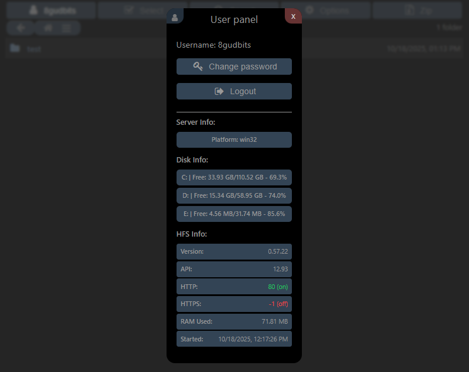

# hfs-server-info

Displays info about server, disk and hfs in user panel.

## Features

- **Server Information**: Platform name
- **Disk Information**: Real-time disk space usage for all drives
- **HFS Status**: Server version, API, ports, and runtime information

## Screenshot

## Configuration

No additional configuration required. The plugin works out of the box.

